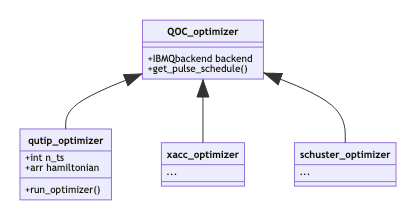

# Quantum Optimal Control for Qiskit

| **Status**     | **Proposed/Accepted/Deprecated**     |
| :------------- | :----------------------------------- |
| **RFC #**      | 0000                                 |
| **Authors**    | Ben Rosand (benjamin.rosand@ibm.com) |
| **Deprecates** | None                                 |
| **Submitted**  | 2020-08-11                           |
| **Updated**    | 2020-08-11                           |

## Summary
This document proposes a framework for automatically building gates using
quantum optimal control. 

Quantum optimal control (QOC) is the process of achieving a desired unitary
evolution of a system using a number of control fields. In this case we target a
quantum system and through microwave pulses applied to drive, measure, and
control channels (arbitrary classical fields), design a desired unitary evolution. The proposed
framework will allow for various optimizers from various sources, such as
QuTiP's GRAPE (gradient ascent pulse engineering) implementation, to be used to
automatically generate pulses for arbitrary unitary gates and incorporate this design process into the circuit-to-pulse scheduling step.


## Motivation

  Currently
  pulses are designed manually for each target gate, and stored in a library for
  each device and calibrated regularly. We propose an optimal control framework
  which will allow gates to be built on the fly for an arbitrary unitary to the
  specifications of the given system. 

  We want to provide users with a pluggable framework allow for designing QOC
  gates on IBM Quantum systems. This framework provides easy access to different
  optimizer methods and implementations, without revealing underlying hardware
  details or optimizer API's. This QOC framework will allow for arbitrary
  unitary gates to be performed on any system using OpenPulse, without
  transpiling these gates to basis gates. In addition, the framework will allow
  for a speedup and potential increase in gate fidelity across circuits, which
  we expect to increase in porportion with the size of the systems and the
  circuits. This work will be especially helpful for gate aggregation, as it
  will allow the automatic calibration of any aggregated gates on the fly, which
  will compound increases in fidelity and speed[1]. We expect this work to be
  impactful for everyone, as researchers will be able to test QOC methods, and
  industry customers will enjoy the gate speedups as well as the automatic
  compilation of gates for gate aggregations.

## User Benefit
  Researchers will enjoy an easy pipeline for testing QOC implementations, as
  well as a pipeline that enables easier compilation of arbitrary unitary gates.
  We expect industry users to benefit from an increase in gate fidelity and
  speed. This will increase the capabilities of the IBM hardware and allow for
  industry users to run more complex circuits with greater fidelity. Finally, in
  addition to all the above benefits, IBM systems groups will have an easier
  method for testing gate aggregation, and more flexibility with methodology, as
  aggregation passes can be compiled into arbitrary unitary gates.
  
  In terms of arbitrary unitary gates, anyone who wants to run their own gates
  will benefit.

## Design Proposal

At a high level, we inherit the `InstructionScheduleMap` class to allow for on
the fly gate generation, which is done with the `QOCOptimizer` interface.

However, to make this process simpler, we also propose (but do not implement) a
new method for organizing the path from instruction to pulse schedule. The
proposal is to create an abstract base class interface `AbstractCalLibrary`
which would be a base class for any pathing of instruction to schedule,
including `InstructionScheduleMap` and `QOCInstructionScheduleMap`. In this new
schema, `InstructionScheduleMap` would be renamed to `CalLibrary` and
`QOCInstructionScheduleMap` would be replaced by `OptimizingCalLibrary`. The
code as laid out below does not implement this change, but this design do should
serve as an example and a starting point to implement this change in the future.

We introduce a new class `QOCInstructionScheduleMap`, which inherits
`InstructionScheduleMap` and modifies the `InstructionScheduleMap.get` function.
The new class `QOCInstructionScheduleMap` will allow users to automatically
calibrate pulses based on desired unitary evolution. The
`QOCInstructionScheduleMap` will enable users to substitute it in wherever they
would use `InstructionScheduleMap`. Thus instead of using the builtin
pulse library we use pulses built on the fly for specific
hardware using quantum optimal control.

We also introduce a new abstract class `QOCOptimizer`, which defines an
interface which allows for easy addition of new optimizers. These new optimizers
will overload the `get_pulse_schedule` method. An example optimizer is
given in the class `QutipOptimizer` illustrated later in this document.

Finally, we make several small changes to `InstructionScheduleMap` and `qiskit.scheduler.methods.basic.py`, to allow for the instruction schedule map to map from gates as well as names.


When considering this design we make the following assumptions:

  1. We must support a variety of backends, with varying qubits numbers,
     qubit-qubit couplings, and hamiltonian specifications.
  2. We must be able to support different optimizers and implementations of said
     optimizers, as described in the introduction to the `QOCOptimizer` class.
     Moreover, the framework should be easily extensible to new optimizer:
     externally and internally.
  3. It should be easy for users to generate pulses for gates with arbitrary
     unitaries, not just gates which are already defined.


### QOC Instruction Schedule Map Class
The `QOCInstructionScheduleMap` is designed to allow users to plug in the qoc
module in any place where the instruction schedule map would normally be used.
This allows for quantum control to be used across the whole stack, and in
concert with simulators and various programs, as long as the underlying backend
supports `OpenPulse`.


### Optimal Control Optimizer Interface
The OCT optimizer interface (`QOCOptimizer`) allows various qoc optimizers [2] to
be used interchangeably. This abstraction allows us to not be
dependent on any optimizer package. In addition, this interface sets up a
framework to easily add in new optimizers, such as those proposed by the Shuster
lab [3].


### Implementation
The current `InstructionScheduleMap` is often used in the `qiskit.schedule`
function. By overloading one method from `InstructionScheduleMap` we can simply
build a circuit as normal and use the builtin qiskit functions with just a new
inst_map parameter.

Below we illustrate the basic pipeline for Quantum Optimal Control in qiskit. This example uses the `QutipOptimizer` class which is the qutip implementation of the `qoc_optimizer` abstract class. However it is important to note this optimizer is easily replacable.
```python
# Instantiate grape optimizer with armonk backend
q_optimizer = QutipOptimizer(backend, number_time_steps, alg='GRAPE')

# Create new QOCInstructionScheduleMap with this optimizer
builtin_instructions = backend.defaults().instruction_schedule_map
grape_inst_map = QOCInstructionScheduleMap.from_inst_map(
                                            qOptimizer,
                                            builtin_instructions)

#Creates a new pulse schedule using the new instruction schedule map
oct_schedule = schedule(circuits, backend=backend, inst_map = grape_inst_map)
```
#### Diagram
Here are the proposed new classes:`QOCInstructionScheduleMap` and `QOCOptimizer`. Below we note the changes in the existing `InstructionScheduleMap` API.


Below is a diagram of the `QOCOptimizer` class.


```
class QOCOptimizer():
    def __init__(self, backend: IBMQbackend):
    
    def get_pulse_schedule(self, input_gate: gate, qubit_targets: list) -> schedule:
```

In addition to writing a new `get` method for `QOCInstructionScheduleMap`, we
also modify the `get` method for the original `InstructionScheduleMap` to have
the same type hints, and simply convert the gate which is passed in the get
method to it's name for mapping to pulse sequences.

In addition to modifying the get method we modify the constructor and define a
new class method `.from_inst_map`, which instantiates a new
`QOCInstructionScheduleMap` from an optimizer and an existing
`InstructionScheduleMap`, which is useful for keeping some default gates such as
the measurement gate.

```python
class QOCInstructionScheduleMap(InstructionScheduleMap):
    def __init__(self, QOCOptimizer: QOCOptimizer):

    def get(self,
      instruction: Union[str, qiskit.circuit.Gate]
      qubits: Union[int, Iterable[int]],
      *params: Union[int, float, complex],
      **kwparams: Union[int, float, complex]) -> Schedule:


    @classmethod
    def from_inst_map(cls,
      oct_optimizer: QOCOptimizer,
      instruction_schedule_map: InstructionScheduleMap
      default_inst: list(str)):
```

### Additional changes to Qiskit stack

In `lowering.py` we replace the call to `InstructionScheduleMap.get()`as shown below
```python
CircuitPulseDef(schedule=inst_map.get(inst.name, inst_qubits, *inst.params),
    qubits=inst_qubits))
#New:
CircuitPulseDef(schedule=inst_map.get(inst, inst_qubits, *inst.params),
    qubits=inst_qubits))
```

This allows us to replace the string name with the gate instance. In the old
`InstructionScheduleMap` we just check if the instruction is a string, and if so
we use it otherwise call `inst.name` to convert from gate to name. This change
is required so that the `QOCInstructionScheduleMap.get()` method can require a
full gate with unitary information.

## Alternative Approaches

One other potential approach to solving this problem would be to write a method
which takes a circuit and converts it into a pulse schedule, which is then run
normally. The problem with this method is it doesn't use existing infrastructure
as smoothly. It requires the oct interface to take in a full circuit, and
reimplement instruction by instruction parsing which is already done in the
`InstructionScheduleMap`. Thus inheriting that class enables us both to plug into
any existing infrastructure and to perform gate-by-gate optimization smoothly.

Another question that is open is the method of passing the gate into the
`QOCInstructionScheduleMap`, we chose to make the slight modifications to the
existing qiskit code. However, to avoid making any changes, it would be possible
to utilize the `params` field of the `instruction`, and place the gate itself
there to pass the unitary through the process. However the method we have chosen
to use allows us to avoid using the `params` field for a regular use case, as
well as increasing the flexibility of the `InstructionScheduleMap`.
## Questions
Open questions for discussion and an opening for feedback.
- Does this pipeline implement multiple qubit gates
  - The first implementation of this framework does not implement multi qubit
  gates. However, we provide a clear path to add multi qubit gates as soon as
  the testing is completed. 
- Does this pipeline allow for gate aggregation?
  - Assuming the gate aggregation takes place before
    `QOCInstructionScheduleMap.get()`is called, then yes as long as the gate has
    a defined unitary. However this pipeline does not assist in the aggregation
    of gates, just in the implementation of the aggregations.
- What is the timeline for this implementation?
  - Currently all the infrastructure for single qubit gates has been
    implemented, with a PR close to ready. However, for the larger systems we
    are testing more precise hamiltonians, that take into account anharmonicity
    and the more complex real system. We expect to finish these models the week
    of Aug 17. In addition, we hope to have finished qutip testing for 2q gates,
    so that they can be implemented correctly the week of Aug 24.
  
- What could cause the timeline to slow down?
  - We expect the implementation to go smoothly, as a lot of the structure is
    already in place and much of the new code already written. However, the
    success of grape has proven to be highly tempermental, and it is possible
    that we might have to devote significant time to testing the more
    generalized form of our qutip GRAPE wrappers. This would also involve
    generalizing the framework for qudits and n-q systems, using a generalized
    RWA.


## Future Extensions
  - We intend to modify this pipeline so that it will function for unitary
    evolutions of arbitrary size. Currently we can only evaluate 1 or 2q gates,
    but in the future we hope to pass in large scale evolutions and optimize
    over them for the whole system.
  - Currently the time of the gate to be used is set by the user, however we
    intend to extend that to a simple heuristic, and later on use some sort of
    optimizer to find a (relatively) ideal time for the gate. Alternative
    optimizers
  - Currently we have only implemented qutip optimizers, however the
    infrastructure that we put in place makes it very easy to add a new
    optimizer. A future extension would involve fully integrating other 
    implementations of QOC.

## References

[1] Shi, Yunong, Nelson Leung, Pranav Gokhale, Zane Rossi, David I. Schuster,
Henry Hoffman, and Fred T. Chong. “Optimized Compilation of Aggregated
Instructions for Realistic Quantum Computers.” Proceedings of the Twenty-Fourth
International Conference on Architectural Support for Programming Languages and
Operating Systems, April 4, 2019, 1031–44.
https://doi.org/10.1145/3297858.3304018. 

[2] Johansson, J. R., P. D. Nation, and
Franco Nori. “QuTiP: An Open-Source Python Framework for the Dynamics of Open
Quantum Systems.” Computer Physics Communications 183, no. 8 (August 2012):
1760–72. https://doi.org/10.1016/j.cpc.2012.02.021. 

[3] Leung, Nelson, Mohamed
Abdelhafez, Jens Koch, and David Schuster. “Speedup for Quantum Optimal Control
from Automatic Differentiation Based on Graphics Processing Units.” Physical
Review A 95, no. 4 (April 13, 2017): 042318.
https://doi.org/10.1103/PhysRevA.95.042318.

[4] “Quantum Optimal Control — QuTiP 4.5 Documentation.” Accessed June 22, 2020. http://qutip.org/docs/latest/guide/guide-control.html.
